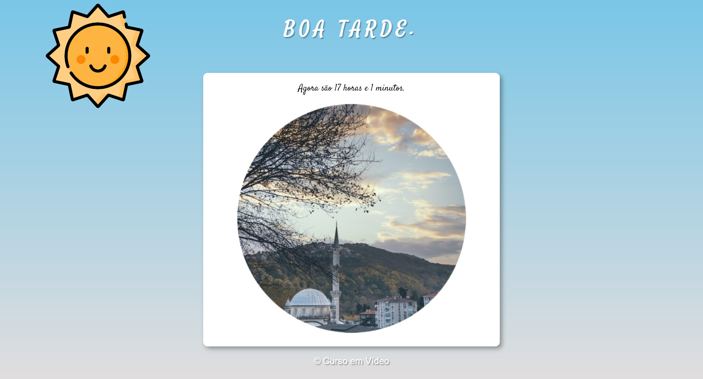

<h1 align="center"> Tom's Jazz </h1>

  <a href="#-tecnologias">Tecnologias</a>&nbsp;&nbsp;&nbsp;|&nbsp;&nbsp;&nbsp;
  <a href="#-projeto">Projeto</a>&nbsp;&nbsp;&nbsp;|&nbsp;&nbsp;&nbsp;

 

  

## 🚀 Tecnologias

Esse projeto foi desenvolvido com as seguintes tecnologias:

- HTML e CSS
- Git e Github
- JavaScript

## 💻 Projeto

É um relógio digital com imagens dinâmica que mudam de acordo com o horário do dia.

- [Acesse o projeto finalizado, online](https://maykbrito.github.io/devlinks)
